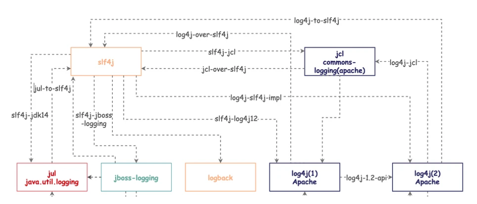
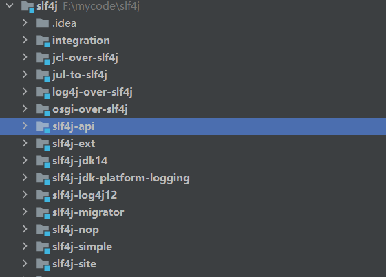

# 概述
阐述java日志框架的关系
## 上层框架和底层实现
### 上层
1. apacha-common-logging(即jcl,Jakarta Commons Logging),同时spring-jcl是完全基于此重写的,包名都是完全一致的
2. SLF4j是一个通用的上层日志框架,查看源码可以得知,该框架通过各种方式兼容了下层实现,同时通过桥连打通了各种上层
3. 上层框架中jcl是通过spi实现,slf4j老版本不是spi实现,后来也改用了spi实现
### 实现
1. juc(java util logging),jdk提供了日志
2. log4j1.2(即log4j),log4j2,都是apache提供的日志
3. logback是SLF4j公司QOS实现的日志,因此默认就能和SLF4j一起使用
## SFL4J整体逻辑

该图可以对照SFL4J源码参考

简单来思考一下如何实现通用上层日志框架,无非是上层定义接口,下层实现,通过spi来实现,或者单纯下层继承上层接口,问题在于log4j,logback,jul并没有遵循同一个接口,因此为了统一,sfl4j和jcl都一定程度上使用了适配器模式.
`slf4j-api`:核心模块,新版本内部通过定义spi接口来实现,同时需要提供中间层的适配器.
`slf4j-log4j12`:log4j1.2的适配器
`slf4j-jdk14`:jul的适配器
`log3j-slf4j0impl`:log4j2的适配器,是apcaha实现的

---
假设系统目前使用的是jul,jcl,或者直接使用log4j这三者使用的接口并不相同,在不改动系统代码的同时使用slf4j,那么就需要桥连,实际上就是重写书写对应jcl,log4j的部分代码
`jcl-over-slf4j`:jcl桥连
`jul-to-slf4j`:jul桥连
`log4j-over-slf4j`:log4j桥连
## JCL逻辑
按照spring-jcl为例,内部的实现就是适配器,分别支持log4j2,jul,slf4j,这里可以看出来jcl可以通过适配器直接支持底层日志,同时可以桥连到sfl4j
```java
	private static final String LOG4J_SPI = "org.apache.logging.log4j.spi.ExtendedLogger";

    //这是log4j2中
	private static final String LOG4J_SLF4J_PROVIDER = "org.apache.logging.slf4j.SLF4JProvider";

	private static final String SLF4J_SPI = "org.slf4j.spi.LocationAwareLogger";

	private static final String SLF4J_API = "org.slf4j.Logger";


	private static final LogApi logApi;
	static {
		if (isPresent(LOG4J_SPI)) { //是否有log4j依赖
			if (isPresent(LOG4J_SLF4J_PROVIDER) && isPresent(SLF4J_SPI)) {
				// log4j-to-slf4j bridge -> we'll rather go with the SLF4J SPI;
				// however, we still prefer Log4j over the plain SLF4J API since
				// the latter does not have location awareness support.
				logApi = LogApi.SLF4J_LAL;
			}
			else {
				// Use Log4j 2.x directly, including location awareness support
				logApi = LogApi.LOG4J;
			}
		}
		else if (isPresent(SLF4J_SPI)) {
			// Full SLF4J SPI including location awareness support
			logApi = LogApi.SLF4J_LAL;
		}
		else if (isPresent(SLF4J_API)) {
			// Minimal SLF4J API without location awareness support
			logApi = LogApi.SLF4J;
		}
		else {
			// java.util.logging as default
			logApi = LogApi.JUL;
		}
	}
```
由代码可以spring-jcl的逻辑是